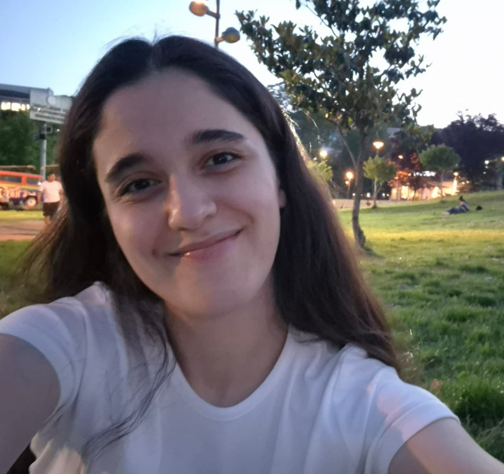
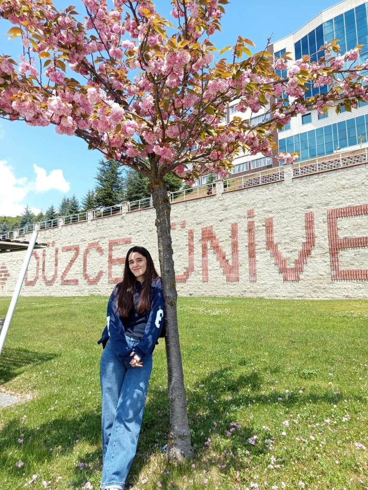
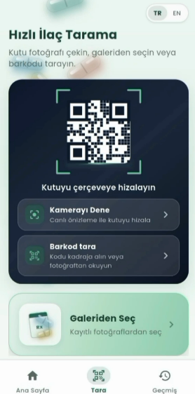
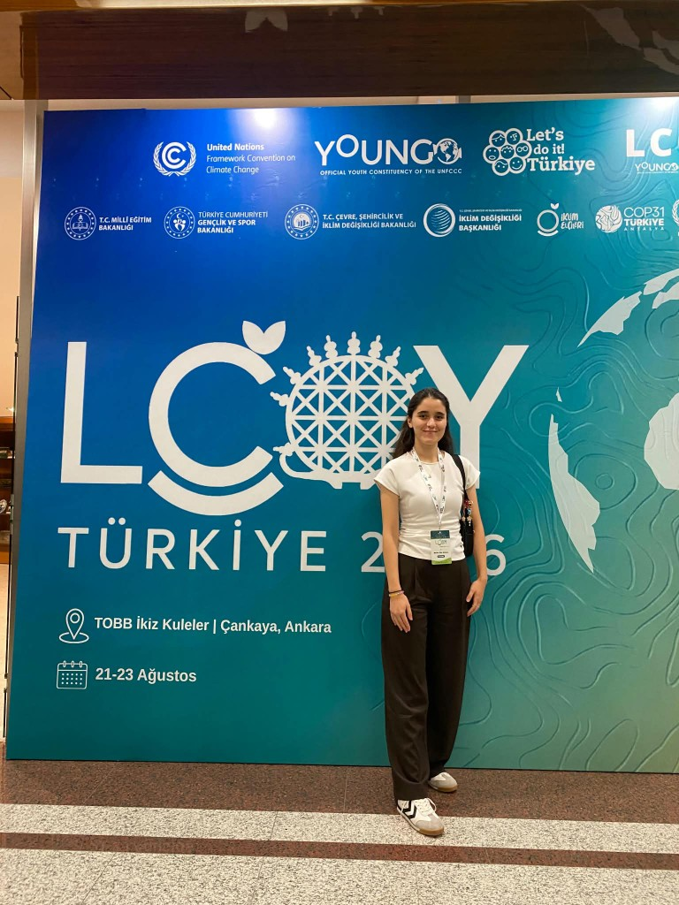

# melikekulahci

**Illustrated bilingual site** for a computer-engineering student who builds
applied vision systems. One page. Four plates. Turkish and English.

[](LICENSE)
[](https://react.dev)
[](https://www.typescriptlang.org)
[](https://vite.dev)

<p align="center">
  
  
  
  
</p>

<p align="center">
  <a href="https://github.com/Melikeda">GitHub</a> ·
  <a href="https://www.linkedin.com/in/melike-kulahci">LinkedIn</a> ·
  <a href="https://www.kaggle.com/melikeklahc">Kaggle</a> ·
  <a href="https://medium.com/@m.edakulahci">Medium</a> ·
  <a href="mailto:m.edakulahci@mail.com">Email</a>
</p>

---

## Hakkında / About

Melike Külahcı, Düzce Üniversitesi Bilgisayar Mühendisliği 4. sınıf öğrencisi.
Odak: **bilgisayarlı görü**, makine öğrenmesi ve modelin ürüne kadar gitmesi.

Ana iş: **[Yolocilin](https://github.com/Melikeda/yolocilin)** — ilaç kutusunu
kamerayla tanıyan uçtan uca sistem (YOLOv8n, OpenCV, EasyOCR, RapidFuzz,
FastAPI, Flutter). Temizlenmiş 395 görsel, Kaggle’da
[CC BY 4.0](https://www.kaggle.com/datasets/melikeklahc/yolocilin-medicine-box-detection)
ile açık. Teknik süreç
[Medium](https://medium.com/@m.edakulahci) serisinde.

Hat: Düzce → Değişim Liderleri Derneği → Argenova (RAG / LLaMA 3 mesai
chatbot) → Cerebrum Tech (Yolocilin, Bilkent Cyberpark) → LCOY Türkiye 2026
(YOUNGO / UNFCCC, COP31 yolu).

This folio is the public front of that path. Recruiters get one scroll, not
seven empty routes.

---

## Design brief

These were the design rules used while building the site — kept here so later
edits do not drift into a generic template.

| Decision | Why |
| --- | --- |
| **Illustrated folio, not a 3D toy** | A WebGL museum looks busy and reads poorly in a 20-second recruiter scan. The unusual part is composition, not polygon count. |
| **Four plates only** | Profile → Timeline → Project → Contact. No `/about` maze. |
| **Paper / ink** | Warm paper (`#efe6d6`) and dark ink (`#14110e`). Copper accent. Light and dark, not “theme soup”. |
| **Fraunces + Figtree + IBM Plex Mono** | Display serif for the name, human sans for body, mono for dates and tools. |
| **Unveil-like photo corridor** | Diagonal 3D stack, **no idle motion**. Cards move only when the visitor scrolls or drags. Three full tours, then Timeline. |
| **Lived photos, not stock** | Campus, internships, LCOY, and a personal film strip. Official Marvel / Spider-Man marks are not used. |
| **Yolocilin as a real phone** | Six cropped app screens (home → camera → result → barcode → history). No fake recording chrome. |
| **TR + EN from one file** | Every string in `src/content/site.ts`. Language sticks in `localStorage`. |
| **Contact is a door, not a form** | Email plus LinkedIn, GitHub, Kaggle, Medium. No backend inbox to leak. |
| **Static and quiet** | No analytics, no form SaaS, no API keys for widgets. |

---

## Plates

| Plate | What you see |
| --- | --- |
| **Profil** | Name, role, school. Scroll-driven photo stack. |
| **Timeline** | Düzce, DLD / Kuanta, Argenova, Cerebrum Tech, LCOY — short note + a still from there. |
| **Proje** | Yolocilin walkthrough and links to the repo + Kaggle set. |
| **İletişim** | Email, social tiles, campus still. |

---

## Stack

- Vite 8 · React 19 · TypeScript
- MapLibre (campus fly-in; tiles are CSP-allowlisted)
- Host target: **Vercel** (static)

Copy first, layout second: edit `src/content/site.ts`.

```
src/
  content/site.ts          ← name, plates, TR/EN, links
  components/plates/       ← Profile, Timeline, Projects, Contact
  components/YoloPhone.tsx
  components/EarthFly.tsx
  components/WebCast.tsx
public/                    ← photos and Yolocilin screens
```

---

## Local

```bash
npm install
npm run dev
```

[http://127.0.0.1:5173/](http://127.0.0.1:5173/)

```bash
npm run build
npm run preview
```

## Deploy

Live: **[melikekulahci.vercel.app](https://melikekulahci.vercel.app)**

Hosted on Vercel from this repo (`vercel.json` + `public/_headers`). After
the Vercel GitHub app is connected, pushes to `main` ship a new production
build. Until then: `npx vercel --prod`.

Check live headers at [securityheaders.com](https://securityheaders.com).

---

## Security

See [SECURITY.md](SECURITY.md). Short version:

- No secrets in the tree. `.env*` is gitignored; `.env.example` is empty on purpose.
- CSP is `script-src 'self'` (theme boot is an external file, not an inline script).
- HSTS, `X-Frame-Options: DENY`, nosniff, locked Permissions-Policy.
- Dependabot (npm + Actions), CI build on `main` and pull requests.
- Secret scanning and push protection on GitHub.
- Photographs in `public/` are **not** MIT — see [LICENSE](LICENSE).

Do not add GitHub/Kaggle tokens to “make a widget work”. Do not commit a
phone number or student number.

---

## License

Source code is [MIT](LICENSE). Photographs and app screenshots stay
© Melike Külahcı — see [NOTICE](NOTICE).
